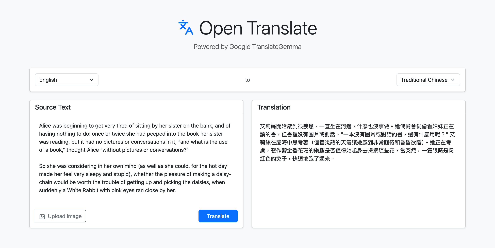
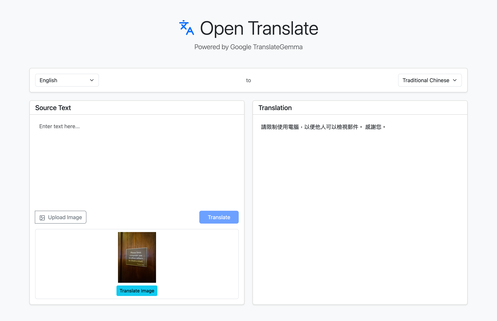

# Open Translate (TranslateGemma)

[](https://colab.research.google.com/github/simonliu-ai-product/open-translate/blob/main/open_translate_project_workflow.ipynb)

An open-source machine translation service based on Google's **TranslateGemma**, featuring both text and image translation capabilities.

## Screenshots

| Text Translation | Image Translation |
| :---: | :---: |
|  |  |

## Features

- **Text Translation**: High-quality translation across 55+ languages.
- **Image Translation**: Multimodal support to translate text directly from images.
- **Traditional Chinese Optimization**: Integrated with OpenCC to ensure high-quality Traditional Chinese (Taiwan) output.
- **Database Logging**: Automatically record all translations to a database (SQLite, PostgreSQL, MySQL supported).
- **Standby Model**: Model is pre-loaded on startup for zero-latency first use.
- **Dockerized**: Easy deployment using Docker and Docker Compose.
- **Modern UI**: Clean and responsive web interface built with React and Bootstrap.

## Tech Stack

- **Model**: Google TranslateGemma (4B-IT)
- **Backend**: FastAPI, PyTorch, Transformers, SQLAlchemy
- **Frontend**: React, Vite, Bootstrap, Lucide React
- **Infrastructure**: Docker, Docker Compose

---

## Getting Started

### Prerequisites

- Docker and Docker Compose
- A Hugging Face account and a Read-access Token ([HF Token](https://huggingface.co/settings/tokens))
- (Optional) NVIDIA GPU with Docker GPU support for faster inference.

### Installation & Run

1. **Clone the repository**:
   ```bash
   git clone https://github.com/simonliu-ai-product/open-translate.git
   cd open-translate
   ```

2. **Set up Environment Variables**:
   Create a `.env` file in the root directory:
   ```env
   HF_TOKEN=your_huggingface_token_here
   NGROK_TOKEN=your_ngrok_token_here (Optional for Colab)
   VITE_BACKEND_URL=http://localhost:8000
   DATABASE_URL=sqlite:///./sql_app.db (Optional)
   ```

3. **Launch with Docker Compose**:
   ```bash
   make up
   # or
   docker-compose up -d
   ```

4. **Access the Web UI**:
   Open [http://localhost:3000](http://localhost:3000) in your browser.

---

## Language Support

For the Traditional Chinese version of this document, please see [README.zh-TW.md](./README.zh-TW.md).

---

## Acknowledgments

- [Google TranslateGemma](https://huggingface.co/collections/google/translategemma)
- [Hugging Face Transformers](https://github.com/huggingface/transformers)
- Simon Liu (Google GDE) for the inspiration and example scripts.
